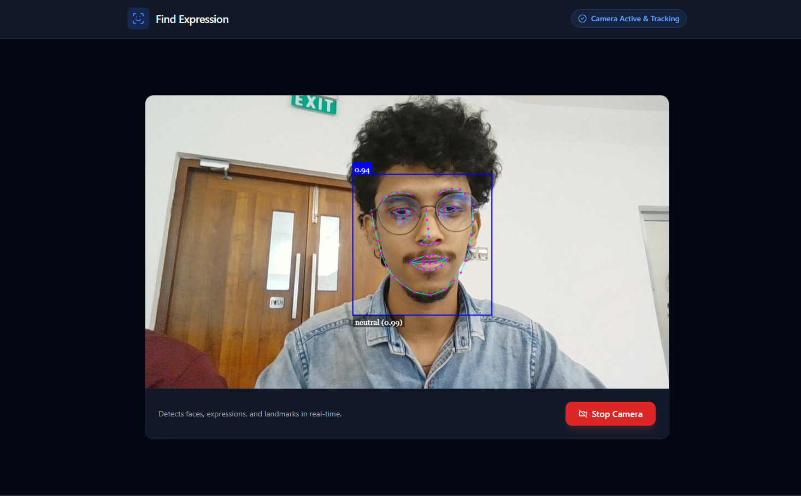

<div align="center">

# 🎯 Face Detection & Emotion Recognition

### *Real-time face analysis powered by AI*

[](https://www.javascript.com/)
[](https://github.com/justadudewhohacks/face-api.js)
[](LICENSE)

</div>

## 📸 Screenshots

<div align="center">

### Face Detection in Action




</div>

## 🎨 Features

<div align="center">

| Feature | Description |
|---------|-------------|
| 👤 **Face Detection** | Real-time multi-face detection |
| 😊 **Emotion Recognition** | 7 emotions with confidence scores |
| 📍 **Face Landmarks** | 68-point facial mapping |
| 🎨 **Modern UI** | Gradient design with smooth animations |
| 📱 **Responsive** | Works on desktop & mobile |

</div>

## 🎭 Detected Emotions

<div align="center">

| 😊 Happy | 😐 Neutral | 😢 Sad | 😠 Angry |
|----------|-----------|--------|----------|
| 😲 Surprised | 😨 Fearful | 🤢 Disgusted |

</div>

## 🚀 Quick Start

### Prerequisites

- Webcam 📹
- Modern browser 🌐
- Local web server 🖥️

### Installation

```bash
# Clone the repository
git clone https://github.com/yourusername/face-detection-app.git

# Enter the directory
cd face-detection-app

# Start a local server
python -m http.server 8000
